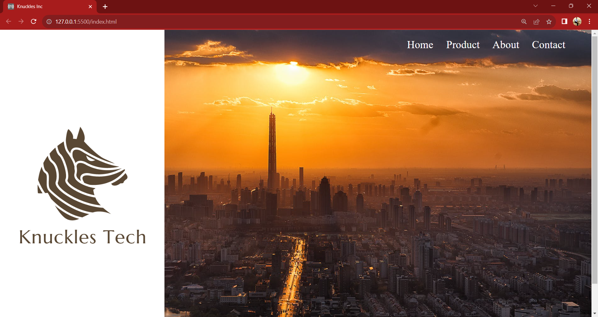

# Landing Page Project 1

### Description
I made this project in 2021 when I was 15 or 16 during my sophomore in high school (during the COVID pandemic). This project was designed to help further my problem solving skills by taking a design, and turning it into code from scratch only by looking at it and breaking it down into smaller pieces.

- I was motivated to build this project because I wanted to further my problem solving skills by challenging myself to build a design from scratch.
- I love projects like these because I naturally love to look at designs and try to build them from scratch. I love the challenge, and the analytical process/thinking my brain goes through when solving problems like these.
- This Project also helped me further my Responsive Web Design Skills using Media Queries

## Technologies Used
- HTML
- CSS

Deployed Site: https://batking74.github.io/Landing-Page-Project/

GitHub Repo: https://github.com/Batking74/Landing-Page-Project/
